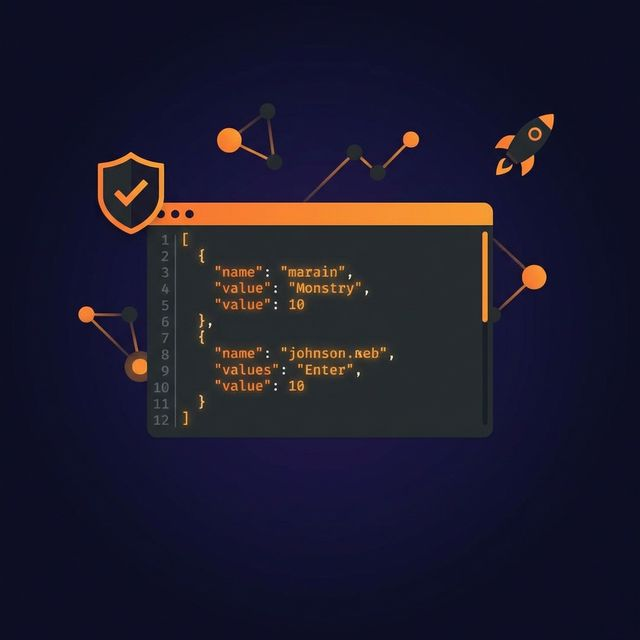

import imageLeslieAlexander from '@/images/team/madalin.jpeg'

export const article = {
  date: '2026-02-11',
  title: 'Announcing etsy-mock-api v0.1.0: Stress-Free Development for Etsy Apps',
  description:
    'Developing integrations for e-commerce platforms is high-stakes work. One wrong API call during testing can accidentally delete a listing, mess up inventory counts, or trigger a real email to a confused customer. Today, we are excited to announce the first official release (v0.1.0) of the Etsy API Mock Server (etsy-mock-api), a robust, open-source tool designed to solve these exact problems.',
  author: {
    name: 'Madalin Ignisca',
    role: 'Co-Founder / CEO',
    image: { src: imageLeslieAlexander },
  },
}

export const metadata = {
  title: article.title,
  description: article.description,
}

Developing integrations for e-commerce platforms is high-stakes work. One wrong API call during testing can accidentally delete a listing, mess up inventory counts, or trigger a real email to a confused customer. On top of that, hitting rate limits while running automated tests is a constant headache.

Today, we are excited to announce the **first official release (v0.1.0)** of the **Etsy API Mock Server** (etsy-mock-api), a robust, open-source tool designed to solve these exact problems.



🚀 [Download Release v0.1.0 on GitHub](https://github.com/vlah-software-house/etsy-mock-api/releases/tag/v0.1.0)

## What is etsy-mock-api?

The **Etsy API Mock Server** is a full mock implementation of the [Etsy Open API v3](https://developers.etsy.com/documentation/) written in Go.
It runs locally on your machine or in your CI pipeline, mimicking the behavior of the real Etsy API—including authentication, headers, error states, and data structures—without ever touching production data.

## Why Release v0.1.0 Matters

This isn't just a static JSON server. This release brings a "batteries-included" experience to Etsy app development. Here is what you get out of the box with v0.1.0:

### 1. Realistic OAuth2 & PKCE Flow

Most mock servers require you to disable authentication to work. We took the hard road. This mock implements the full **OAuth2 Authorization Code flow with PKCE**.

- It validates API keys (x-api-key).
- It handles token exchanges and refresh tokens.
- **Scope Enforcement:** If your token lacks the `listings_w` scope, the mock server *will* reject your POST request, ensuring your app handles permissions correctly before you go live.

### 2. Pre-Seeded, Realistic Data

You don't need to waste hours scripting seed data. The server boots up with a complete in-memory ecosystem:

- **Users & Shops:** Includes test users (Alice, Bob) and fully configured shops ("AliceCrafts").
- **Inventory:** Active, draft, and digital listings ready to be queried or updated.
- **Financials:** Pre-populated receipts, transactions, and ledger entries to test your accounting logic.
- **Taxonomy:** A functional buyer and seller taxonomy tree.

### 3. Safe E2E Testing

With this mock, you can run destructive tests without fear.

- Want to test your "Delete Listing" button? Go ahead.
- Need to flood the API to test your rate-limit handling? The mock sends back valid `x-limit-per-second` headers.
- **Reset on Restart:** Because the store is in-memory, simply restarting the server gives you a clean slate for the next test run.

## Getting Started

You can get up and running in seconds. Download the source or binary from the [v0.1.0 release page](https://github.com/vlah-software-house/etsy-mock-api/releases/tag/v0.1.0), or run it directly with Go:

```bash
# Start the server on port 8080
go run ./cmd/server
```

Once running, you can immediately start making requests.

**Check a shop (No Auth needed if using -no-auth flag, otherwise use API key):**

```bash
curl -H "x-api-key: myapp:mysecret" http://localhost:8080/v3/application/shops/5001
```

**Simulate an OAuth Token Exchange:**

```bash
curl -X POST http://localhost:8080/v3/public/oauth/token \
  -d "grant_type=authorization_code&client_id=myapp&code=mock_code_1001&code_verifier=test&redirect_uri=http://localhost"
```

## What's Next?

We built this tool because we needed a better way to ensure quality and stability in Etsy integrations. With v0.1.0, the core foundation is set: Listings, Shops, Transactions, and Authentication are stable and ready for use.

We invite the community to try it out, break it, and help us improve it.

- **Download:** [Release v0.1.0](https://github.com/vlah-software-house/etsy-mock-api/releases/tag/v0.1.0)
- **Repository:** [github.com/vlah-software-house/etsy-mock-api](https://github.com/vlah-software-house/etsy-mock-api)
- **Issues:** Found a bug? Open an issue on GitHub!

Happy Coding! 🛠️
