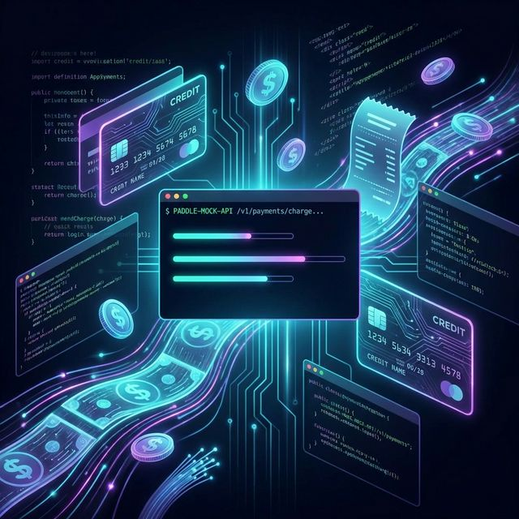

import imageLeslieAlexander from '@/images/team/madalin.jpeg'

export const article = {
  date: '2026-02-12',
  title: 'Stop Tunneling. Start Building. Introducing paddle-mock-api: The Localhost Hero for Paddle Billing',
  description:
    'Integrating billing systems is usually a nightmare. You are stuck waiting for sandbox webhooks, fighting with ngrok tunnels, and polluting staging with test users. We built paddle-mock-api, a lightweight, zero-dependency Go mock server that simulates the Paddle Billing API right on your machine. No internet required. No latency. No nonsense.',
  author: {
    name: 'Madalin Ignisca',
    role: 'Co-Founder / CTO',
    image: { src: imageLeslieAlexander },
  },
}

export const metadata = {
  title: article.title,
  description: article.description,
}

Let's be real: Integrating billing systems is usually a nightmare. You're stuck in a loop of waiting for sandbox webhooks, fighting with ngrok tunnels that expire every hour, and polluting your staging environment with thousands of test users named test\_1234@gmail.com. It's slow. It's brittle. It kills your flow state.

**It's time to cut the cord.**

Enter [**paddle-mock-api**](https://github.com/vlah-software-house/paddle-api-mock). We built a lightweight, zero-dependency Go mock server that simulates the Paddle Billing API right on your machine. No internet required. No latency. No nonsense.



🚀 [Star the Repo & Download on GitHub](https://github.com/vlah-software-house/paddle-api-mock)

## The "Works on My Machine" Power Move

paddle-mock-api isn't just a static JSON responder. It is a logic-aware simulation of the Paddle ecosystem designed for high-velocity local development and rock-solid E2E testing. Here is why it belongs in your toolkit:

### 1. Zero Bloat. Single Binary.

We hate dependency hell as much as you do. This tool requires:

- No Database.
- No Docker containers eating your RAM.
- No complex configuration files.

It is a single Golang binary. You download it, you run it, it works.

```bash
# It's this simple
curl -L -o paddle-mock-api \
  https://github.com/vlah-software-house/paddle-api-mock/releases/latest/download/paddle-mock-api-darwin-arm64
chmod +x paddle-mock-api
./paddle-mock-api
```

Boom. You have a full billing API running on port 8081.

### 2. Time Travel Included

Testing subscription lifecycles is historically painful. How do you test a trial expiration? Wait 14 days? Manually hack a database?

With our **Admin API**, you are the master of time. You can force a subscription to travel from trialing to active, or trigger a payment failure to see how your UI handles a past\_due state.

```bash
# Fast forward time instantly
POST /admin/advance-time/{subscription_id}
```

### 3. Webhooks That Actually Work

Stop waiting for the internet. Register a local webhook URL, and paddle-mock-api will fire events immediately when you change state.

And yes, we sign them. The mock server calculates the HMAC-SHA256 signature using a test secret (`pdl_test_signing_secret`), so your signature verification logic runs exactly as it would in production.

### 4. CI/CD Ready

Because it's a standalone binary with seeded data (Alice, Bob, and the "Yieldly" products), you can drop this into your GitHub Actions or GitLab CI pipelines. Run your entire billing integration test suite in seconds, not minutes. No external network calls means no flaky tests.

## Under the Hood

We support the core flows you actually need to build a SaaS:

- **Products & Prices:** Fully queryable.
- **Customers:** Create, update, and retrieve.
- **Subscriptions:** Pause, resume, cancel, and charge.
- **Transactions:** Validate payment flows.

Authentication is built-in (Bearer token), but if you just want to hack something together fast, pass the `-no-auth` flag and go wild.

## Get It Now

This is open source. It's free. It's built to make your life easier. Stop letting billing integration hold your roadmap hostage.

- **Star the Repo & Download:** [github.com/vlah-software-house/paddle-api-mock](https://github.com/vlah-software-house/paddle-api-mock)
- **Issues:** Found a bug? Open an issue on GitHub!

Happy Coding! 🛠️

*Disclaimer: This is a community project for local testing and is not affiliated with Paddle. Always test against the real Paddle Sandbox before deploying to production.*
